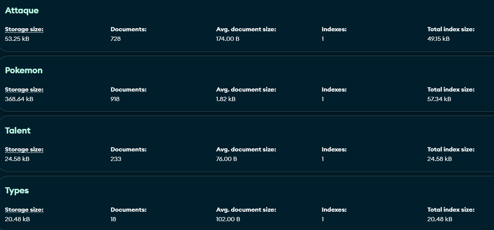

# **Projet Pokemon**

## À propos

Le projet Pokemon est une application web utilisant React pour simuler un combat pokémon en utilisant une api créer avec express
utilise une database MongoDB pour récupérer les informations des pokémon.

La partie express est disponible ici : https://github.com/maxance13/express-pokemon

# Accès au Site

Le site est disponible via l'URL suivante : https://first-react-app-steel.vercel.app/

---

# Technologies Utilisées:

- Langage de Programmation: [JavaScript]
- Framework: [React]

## Base de données :

- Base de Données: [MongoDB]

---
